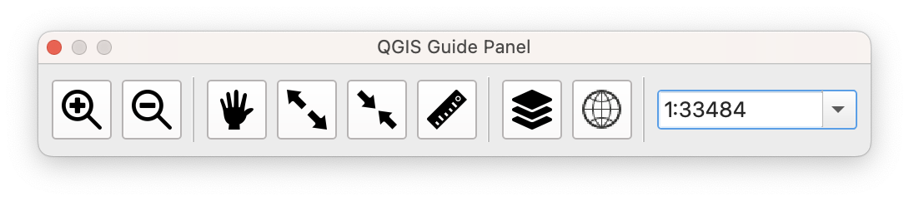
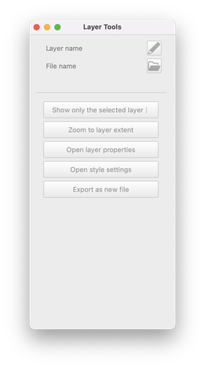
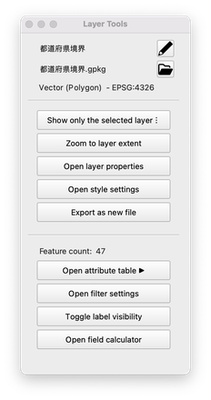
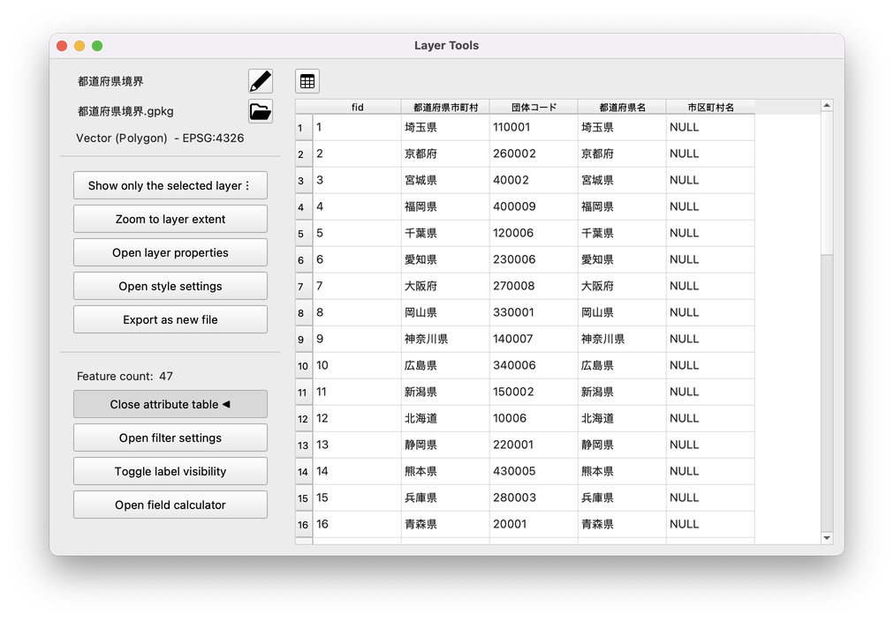
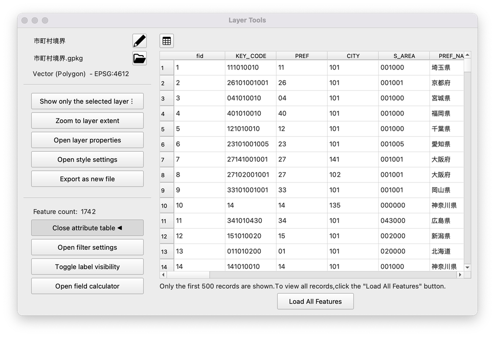
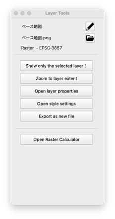

# q_guide_panel
A convenient tool that makes it easy to perform frequently used QGIS actions such as map navigation, zooming, attribute viewing, and label toggling.

---

## Features
 
- Preview display of attribute table
- Temporarily display only a specific layer
- Toggle layer labels ON/OFF  
- Zoom in/out, display and change current scale  
- Create latitude/longitude grid lines from map extent (supports separate files for lat/lon)  
- Shortcuts to standard QGIS functions: layer style, filter settings, attribute table, raster calculator, etc.

---

## Installation

1. Start QGIS and open [Plugins] → [Manage and Install Plugins]  
2. Search for 'QGIS Guide Panel' and install it  
3. Select [Plugins] → 'QGIS Guide Panel' to display the panel

---

## Usage

### Control Panel

When you launch this plugin, the following control panel will appear.

The panel contains tools useful for map navigation and measurement, listed from left to right as follows:

- Zoom in on the map

	Click to zoom in the map view by one step.
    
- Zoom out of the map
    
	Click to zoom out the map view by one step.
    
- Pan tool
    
	The cursor changes to a hand icon, allowing you to drag the map to move it.
    
- Zoom in by selection
    
	Zooms in to the area you drag on the map.
    
- Zoom out by selection
    
	Zooms out according to the dragged area.

- Distance Measurement Tool
    
	Click to activate distance measurement mode, then draw a line to measure the distance.
    
- Display Layer Operation Panel
    
	Displays a dedicated panel for performing operations on the current layer.
    
- Latitude/Longitude Grid Creation Tool
    
	Draws a latitude/longitude grid on the map. Right-click to display a submenu with the following settings:    
	- Specify the spacing of latitude and longitude lines
	- Option to separate latitude and longitude lines into different layers
	- Option to save as a file instead of a temporary layer

- Set Scale
    
	Enter a desired scale directly to change the map display.
    

### Layer Tools

When you click the Layer Operation Panel button in the control panel, the following layer tools will be displayed.

In the initial state (when no layer is selected), the panel is grayed out and no operation items are displayed.  
The display content changes according to the layer selected by the user in QGIS’s standard Layer Panel.

**[When a vector layer is selected (attribute table section hidden)]**

When a vector layer is selected, the panel becomes active and the corresponding operation items are displayed.

From top to bottom, the functions are as follows.  
If "⋮" is displayed to the right of the button name, right-click to open the submenu.

- Display/Edit Layer Name  
    - Displays the name of the selected layer.  
    - Click the pencil icon to edit the name; click again to apply the changes to the layer.
- Display File Name / Open Folder  
    - Displays the file name of the selected layer.  
    - Click the folder button to open the folder where it is saved.
- Layer Type and CRS  
    - Displays the type and EPSG code of the selected layer.
- Show Only the Selected Layer  
    - Click to display only the selected layer on the map, temporarily hiding other layers.  
    - When the selected layer changes, the display target follows accordingly.  
    - Click again to return to the original display state.  
    - Right-click to open a submenu and individually specify layers not to be hidden.  
    - If the panel is closed, the original display state is automatically restored.
- Zoom to Layer Extent  
    - Zooms and pans the map area to fit the entire extent of the selected layer.
- Open Layer Properties  
    - Opens the Layer Properties window of the selected layer.
- Open Style Settings  
    - Opens the Style Settings panel of the selected layer.
- Export as New File  
    - Opens a window to export the selected layer as a new file.
- Feature Count Field  
    - Displays the number of features in the selected layer.
- Open Attribute Table  
    - Opens the Attribute Table panel for the selected layer.
- Toggle Label Visibility  
    - Turns label display of the selected layer ON/OFF.  
    - If label settings already exist, they are preserved while toggling display.  
    - Right-click to select the field used for labeling.  
    - However, if complex settings such as rule-based labels are used, this function is disabled.
- Open Field Calculator  
    - Opens the Field Calculator window for the selected layer.

**[When a vector layer is selected (attribute table section displayed)]**

When you click the "Open Attribute Table" button, the attribute table section for the selected layer will be displayed.

- Displays the attribute table of the selected layer.  
- When another layer is selected in the Layer Panel, the attribute table switches to the newly selected layer.  
- The button at the top of the attribute table opens the standard QGIS attribute table window for the currently selected layer.

If the selected layer contains more than 500 features, the following button is displayed:

- Click the "Load All Features" button to display the attribute table for all features.

**[When a raster layer is selected]**

When a raster layer is selected, the panel changes as follows:

From the top to the "Export as New File" button, the functions are the same as for vector layers.

- Open Raster Calculator  
    - Opens the Raster Calculator window for the selected layer.

---

## Requirements

- QGIS 3.22 or later  
- Standard environment (no additional libraries required)

---

## Author

- 技術チーム合同会社  
  TechTeam Solutions LLC
  https://techteam.co.jp/

---

## License

GPL-3.0 license
