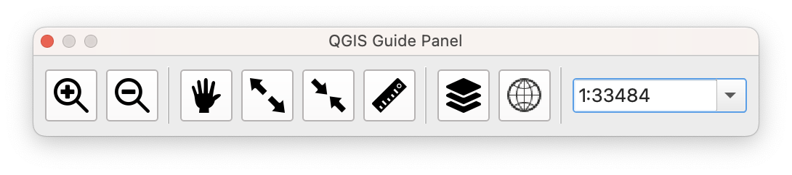

# q_guide_panel
地図の移動や拡大縮小、属性確認、ラベル切り替えなど、QGISでよく使う機能を簡単に実行できる便利ツールです。

---

## 主な機能
 
- 属性テーブルのプレビュー表示
- 一時的に特定レイヤのみを表示
- レイヤラベルのON/OFF  
- ズームイン・アウト、現在の倍率表示と変更  
- 地図範囲から緯度経度ラインを作成（緯度経度別ファイル対応）  
- QGIS標準機能のショートカット：レイヤスタイル、フィルター設定、属性テーブル、ラスタ計算機など

---

## インストール方法

1. QGISを起動し、[プラグイン] → [プラグインを管理とインストール] を開きます  
2. 「QGIS Guide Panel」で検索し、インストールします  
3. [プラグイン] → 「QGIS Guide Panel」 を選択すると表示されます

---

## 使い方

### コントロールパネル

このプラグインを起動すると、以下のようなコントロールパネルが表示されます。

パネルには地図操作や計測などに便利なツールが並んでおり、左から順に以下の機能を持ちます。

- 地図拡大ボタン
    
    クリックすると、地図表示が一段階拡大されます。
    
- 地図縮小ボタン
    
    クリックすると、地図表示が一段階縮小されます。
    
- 地図移動（パン）ツール
    
    カーソルが手のひらアイコンに変わり、地図をドラッグして移動できます。
    
- 範囲指定による拡大
    
    地図上でドラッグした範囲にズームインします。
    
- 範囲指定による縮小
    
    ドラッグした範囲に応じてズームアウトします。
    
- 距離計測ツール
    
    クリックで距離測定モードを起動し、線を引いて距離を計測できます。
    
- レイヤ操作パネルの表示
    
    現在のレイヤに対する操作を行う専用パネルを表示します。
    
- 緯度経度ライン作成ツール
    
    地図上に緯度経度グリッドを描画します。右クリックでサブメニューが表示され、以下の設定が可能です：
    
    - 緯度・経度のライン間隔の指定
    - 緯度・経度ラインを別レイヤに分ける設定
    - 仮レイヤではなくファイルとして保存する設定
- 縮尺の指定
    
    任意の縮尺を直接入力して地図表示を変更できます。
    

### レイヤツール

コントロールパネルでレイヤ操作パネルボタンをクリックすると以下のようなレイヤツールが表示されます。

初期状態（レイヤ未選択時）では、パネルはグレーアウトされ、操作項目は表示されません。
QGIS 標準のレイヤパネルでユーザーが選択したレイヤに応じて表示内容が切り替わります。

**【ベクタレイヤ選択時（属性テーブル欄非表示）】**

ベクタレイヤを選択すると、パネルが有効化され、対応する操作項目が表示されます。

上から順に以下の機能を持ちます。ボタン名の右に「⋮」が表示されている場合は右クリックでサブメニューが表示されます。

- レイヤ名表示・編集
    - 選択中のレイヤ名を表示します。
    - 鉛筆アイコンをクリックすると名前を編集でき、再度クリックでレイヤに反映されます。
- ファイル名の表示、フォルダ表示
    - 選択中レイヤのファイル名を表示します。
    - フォルダボタンを押すと、保存場所のフォルダが開きます。
- レイヤの種類、CRS
    - 選択中レイヤの種類とEPSGが表示されます。
- 選択レイヤのみを表示
    - クリックすると、選択中のレイヤのみが地図に表示され、他のレイヤは一時的に非表示になります。
    - レイヤ選択を変更すると、表示対象も追従します。
    - 再度クリックすると元の表示状態に戻ります。
    - 右クリックでサブメニューが表示され、非表示にしないレイヤを個別に指定することも可能です。
    - パネルを閉じた場合は自動で元の状態に復元されます。
- レイヤ範囲にズームする
    - 選択中レイヤ全体が表示される範囲に地図エリアがズーム・縮小されます。
- レイヤプロパティを開く
    - 選択中レイヤのレイヤプロパティウインドウが開きます。
- スタイル設定を開く
    - 選択中レイヤのスタイル設定パネルが開きます。
- 新規ファイルでエクスポートする
    - 選択中レイヤを新規ファイルでエクスポートするウインドウが開きます。
- 地物数欄
    - 選択中レイヤの地物数を表示します。
- 属性テーブルを開く
    - 選択中レイヤの属性テーブルを確認するパネルが開きます。
- ラベル表示を切り替える
    - 選択中レイヤのラベル表示をON/OFFします。
    - すでにラベル設定がある場合はその内容を維持して表示／非表示を切り替えます。
    - 右クリックで表示フィールドを選択できます。
    - ただし、ルールベースなどの複雑な設定がある場合、この機能は無効になります。
- フィールド計算機を開く
    - 選択したレイヤのフィールド計算機ウインドウを開きます。

**【ベクタレイヤ選択時（属性テーブル欄表示）】**

「属性テーブルを開く」ボタンを押すと選択レイヤの属性テーブル欄が表示されます。

- 選択中レイヤの属性テーブルが表示されます。
- レイヤパネルで別のレイヤを選択すると、属性テーブルは選択したレイヤに変わります。
- 属性テーブル上部のボタンで、選択しているレイヤQGIS標準の属性テーブルウインドウを開きます。

地物数が500件を超えるレイヤの場合、以下のようにボタンが表示されます。

- 全件表示ボタンをクリックするとすべての地物の属性テーブルが表示されます。

**【ラスタレイヤ選択時】**

ラスタレイヤを選択すると以下のように変わります。

上から「新規ファイルでエクスポートする」ボタンまではベクタレイヤのときと同じ機能です。

- ラスタ計算機を開く
    - 選択したレイヤのラスタ計算機ウインドウを開きます。

---

## 対応環境

- QGIS 3.22 以降
- 標準環境（追加ライブラリなし）

---

## Author

- 技術チーム合同会社  
  TechTeam Solutions LLC
  https://techteam.co.jp/

---

## License

GPL-3.0 license
